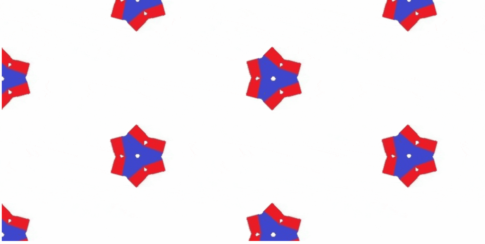

<a name="readme-top"></a>
<br />

<div align="center">
  <a href="">
    
  </a>

  <h3 align="center">Kaleidoscope Canvas</h3>

  <p align="center">
    <br />
    <a href="https://jeromejoh.github.io/kaleidoscope-canvas/">View Demo</a>
  </p>
</div>

### About The Project

This component is inspired by the article [Canvas Kaleidoscope](https://www.pepperoni.blog/canvas-kaleidoscope/) and provides an easy way to embed a customizable kaleidoscope animation into any web page. Built with pure HTML, CSS, and JavaScript, `<kaleidoscope-canvas>` lets you create dynamic visual effects with minimal setup. Simply add the component to your HTML and configure its attributes to achieve the desired kaleidoscope style.

### Customization

You can configure the `<kaleidoscope-canvas>` web component using the following attributes:

| Attribute       | Description                                 | Type   | Default      |
| --------------- | ------------------------------------------- | ------ | ------------ |
| `canvas-width`  | Width of the canvas in pixels               | Number | 800          |
| `canvas-height` | Height of the canvas in pixels              | Number | 400          |
| `triangle-side` | Side length of each triangle unit in pixels | Number | 150          |
| `base-src`      | Path to the main pattern image              | String | `/base.jpg`  |
| `base-r-src`    | Path to the reversed pattern image          | String | `/baseR.jpg` |
| `move-speed`    | Movement speed of the pattern               | Number | 1            |

**Example usage:**

```html
<kaleidoscope-canvas
  canvas-width="800"
  canvas-height="400"
  triangle-side="150"
  base-src="/base.jpg"
  base-r-src="/baseR.jpg"
  move-speed="1"
>
</kaleidoscope-canvas>
```

### Preview



### Contact

Author: [jerome200069@outlook.com](mailto:jerome200069@outlook.com)

Demo Link: [https://github.com/JeromeJoh/it-gives-you-butterflies](https://github.com/JeromeJoh/it-gives-you-butterflies)

### License

[MIT](LICENSE)
